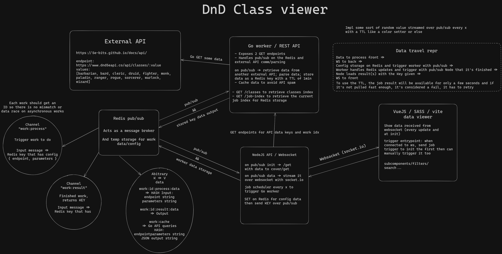

# DnD Class viewer

Dungeon and Dragons class and sub-class viewer using [this free no-auth API](https://5e-bits.github.io/docs/api/).

## Context

This project is a technical test for a Fullstack Developer job at [Pingflow](https://www.pingflow.com/).

The project has a 1 week deadline and requires 3 technologies:
- a [Go](https://go.dev) backend worker using [Redis](https://redis.io/) (pub/sub pattern)
- a [NodeJS](https://nodejs.org/) (migrated to [Deno](https://deno.land/)) API using Websockets (with [socket.io](https://socket.io/) since they use it internally)
- a [VueJS](https://vuejs.org/) frontend using [Sass](https://sass-lang.com/) for styling, [Pinia](https://pinia.vuejs.org/) for state management and [Vite](https://vite.dev/) as a build tool

Here is a quick [Excalidraw](https://excalidraw.com/) that I made that represents the app:

